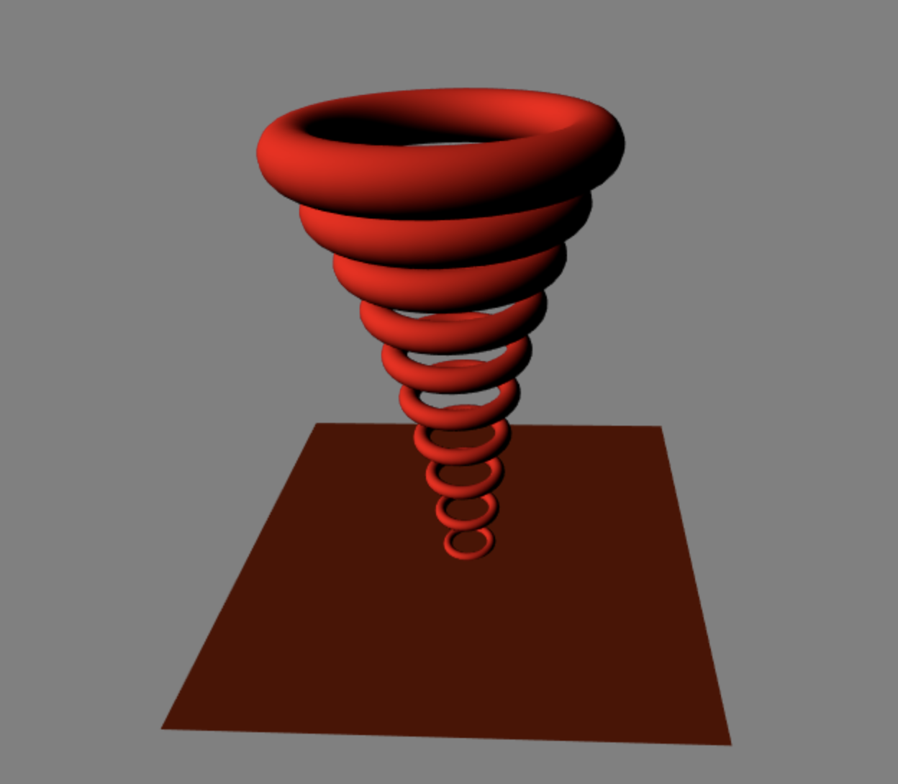

# CIS 566 Homework 4: L-Systems

## Overview

Matthew Riley\
PennKey: matriley\
Live at: https://mgriley.github.io/hw04-l-systems/

## Description:

There is sadly much more work to be done, but the basic mechanisms function. The L-system implementation is in turtle.ts. Blob.ts contains a helper function called generate_mesh for creating meshes from 2d parameterized surfaces, for the torus. The goal is to eventually create a kind of chain-link tree of toruses, but here's what I have for now.

